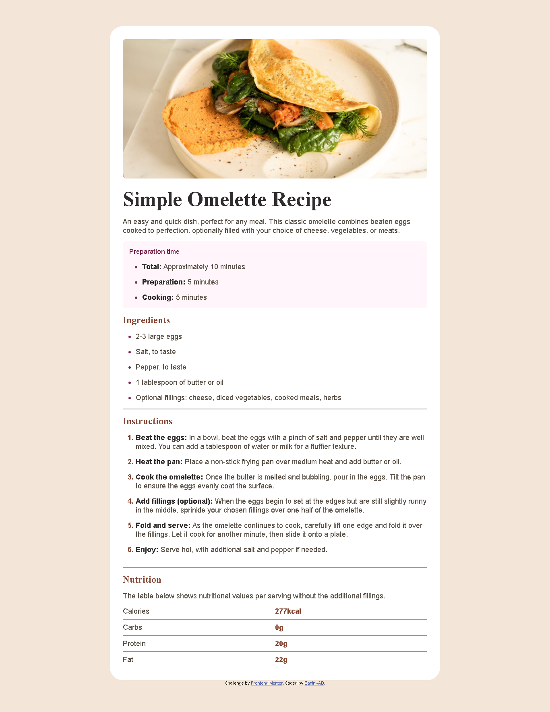

# Frontend Mentor - Blog preview card solution

This is a solution to the [Blog preview card challenge on Frontend Mentor](https://www.frontendmentor.io/challenges/blog-preview-card-ckPaj01IcS). Frontend Mentor challenges help you improve your coding skills by building realistic projects.

## Table of contents

- [Overview](#overview)
  - [The challenge](#the-challenge)
  - [Screenshot](#screenshot)
  - [Links](#links)
- [My process](#my-process)
  - [Built with](#built-with)
  - [What I learned](#what-i-learned)
  - [Continued development](#continued-development)
  - [Useful resources](#useful-resources)
- [Author](#author)

## Overview

### The challenge

### Screenshot

-Desktop Preview: 
-Mobile Preview: 

### Links

- Solution URL: [Add solution URL here](https://github.com/Banini-AD/Recipe-Page)
- Live Site URL: [Add live site URL here](https://recipe-page-imb6-git-recipe-page-baninis-projects.vercel.app/)

## My process

### Built with

- Semantic HTML5 markup
- CSS custom properties
- Flexbox
- Mobile-first workflow

### What I learned

This project helped me understand the hr element in html. It showed me how important it is to use the hr element when creating web content.

I learned that using the hr element helps create a clear, stylish and a minimal division without adding heavy graphic elements, keeping my design clean while improving readability. It also helps to add semantic structure that can aid both users and search engines in understanding my content's flow.

Overall, this project greatly expanded my knowledge of web development best practices and taught me more about how the hr element works. It empowered me to create better and more responsive websites.

### Continued development

I would like to improve my code for great semantic structure. This will help me create better and more user-friendly websites.

### Useful resources

- [W3Schools](https://www.w3schools.com) - This article gave me a complete theory on the hr element. I really liked it and will use it going forward.I'd recommend it to anyone still learning this concept.
- [Youtube](https://www.youtube.com) - This helped me get to know how the hr element is applied in projects. I'd recommend it to anyone still learning this concept.

## Author

- Website - [Banini-AD](https://www.your-site.com).
- Frontend Mentor - [@Banini-AD](https://www.frontendmentor.io/profile/Banini-AD).
